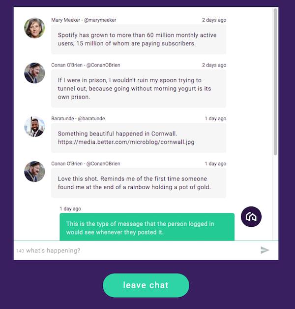
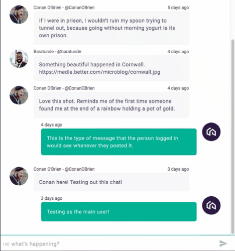

# Chat
[Chat](https://better-chat.herokuapp.com/#/signin "Chat") (live) is a simple chat app. You can either log in as the main user by clicking continue, or proceed as Conan to see the perspective of the chat update.

## Table of contents
* [Features](#features)
* [Technologies](#technologies)
* [Main Chat](#main-chat)
* [Code Samples](#code-snippets)
* [Additional Features](#additional-features)

## Features
  * Landing Page - continue as the main user or continue as Conan and see the perspective of the chat change
  * App has full user authentication functionality (signing up, logging in) - not displayed in demo but easily convertable
  * The chat has avatars for those who are signed up
    * The avatar will update depending on who is signed in (main user or conan). This is dynamic and works for every user that is signed up
  * Autoscrolls to the most recent message
  * Maximum of 140 characters per message
    * Displays an active counter
  * Each message displays the user handle and their real name
  * Each message displays the time elapsed of that particular message
  * Each message will display the date of when the message is created upon click
  * A modal notification will appear if an empty message is entered

## Technologies
  * Node.js
  * Express
  * MongoDB
  * React
    * React hooks (useState, useEffect)
  * Redux
    * Redux hooks (useSelector, useDispatch)
  * HTML/CSS3

## Main Chat
desktop version



mobile version


## Code Snippets
    
Code snippet of react hooks useEffect and redux hooks useDispatch to dispatch the initial render of chat messages. Once a new message is sent, the chat auto scrolls to the most recent message. The store is cleared of messages and users when exiting the chat. (frontend/src/components/chat.jsx)

```javascript
  useEffect(() => {
    getUsers()(dispatch);
    getMessages()(dispatch).then(res => {
      updateScroll(chatBox);
    })

    return () => {
      dispatch(clearMessages());
      dispatch(clearUsers());
    }
  }, []);
```

Code snippet of chat messages using message data from the redux store retrieved using redux hooks useSelector. Then using a hashMap to lookup username and their real name, optimizing the amount of data passed into each message sub-component (frontend/src/components/chat.jsx)

```javascript
  const allMessages = useSelector(({ messages }) => {
    return messages.all;
  });

  const allUsers = useSelector(({ users }) => {
    return users.all;
  });

  const getChat = (allUsers, allMessages) => {
    const usersHashMap = {}

    allUsers.forEach(user => {
      usersHashMap[user._id] = {
        username: user.username,
        real_name: user.real_name
      }
    })

    return allMessages.map(message => {
      if (!message) return;
      let username = usersHashMap[message.user].username;
      let real_name = usersHashMap[message.user].real_name;

      return <MessageItem
        key={message._id}
        userId={message.user}
        message={message.message}
        username={username}
        real_name={real_name}
        date={message.date}
      />
    })
  }
```

Code snippet of live character count (frontend/src/components/chat.jsx)

```javascript
  const [length, setLength] = useState(140);

  const handleTyping = (e) => {
    e.preventDefault();
    setMessage(e.currentTarget.value);
    setLength(140 - e.currentTarget.value.length)
  }

  return (
    <div>{length}</div>
    <input type='text'
      value={message}
      maxLength='140'
      placeholder="what's happening?"
      className='input-box'
      onChange={e => handleTyping(e)}
    />
  )
```
Code snippet of parsing date and parsing elapsed message time for each message subcomponent (frontend/src/util/parse.js)

```javascript
  export const parseDate = (d) => {
    const split = d.split("T")[0].split("-");
    const [year, month, day] = split;
    const monthMap = {
      "01": "January", "02": "February", "03": "March",
      "04": "April", "05": "May", "06": "June",
      "07": "July", "08": "August", "09": "September",
      "10": "October", "11": "November", "12": "December",
    }

    return `${monthMap[month]} ${day}, ${year}`
  }

  export const parseElapsedTime = (d) => {
    const date = new Date(d);
    const [year, month, day] = [date.getFullYear(), date.getMonth(), date.getDate()]
    const [hour, min, sec] = [date.getHours(), date.getMinutes(), date.getSeconds()]

    const now = new Date();
    const [getYear, getMonth, getDay] = [now.getFullYear(), now.getMonth(), now.getDate()]
    const [getHour, getMin, getSec] = [now.getHours(), now.getMinutes(), now.getSeconds()]

    if (getYear - year > 0) {
      return getYear - year === 1 ? `${getYear - year} year ago` : `${getYear - year} years ago`;
    } else if (getMonth - month > 0) {
      return getMonth - month === 1 ? `${getMonth - month} month ago` : `${getMonth - month} months ago`;
    } else if (getDay - day > 0) {
      return getDay - day === 1 ? `${getDay - day} day ago` : `${getDay - day} days ago`;
    } else if (getHour - hour > 0) {
      return getHour - hour === 1 ? `${getHour - hour} hour ago` : `${getHour - hour} hours ago`;
    } else if (getMin - min > 0) {
      return getMin - min === 1 ? `${getMin - min} min ago` : `${getMin - min} mins ago`;
    } else if (getSec - sec > 0) {
      return getSec - sec === 1 ? `${getSec - sec} sec ago` : `${getSec - sec} secs ago`;
    } else {
      return `now`
    }
  }
```
Code snippet of each avatar being handled statically. This can be updated dynamically if the imgs were to come from a DB/cloud and each avatar rendered individually set by setAvatar(); (frontend/src/components/message_item.jsx)

```javascript
  useEffect(() => {
    parseElapsedTime(date);

    if (username === 'marymeeker') {
      setAvatar()
    } else if (username === 'ConanOBrien') {
      setAvatar()
    } else if (username === 'baratunde') {
      setAvatar()
    } else if (username === 'better') {
      setAvatar(<Better viewBox='-85 -85 350 350' className='avatar better-avatar' />)
    }

  }, [])
```

## Additional Features

Live character count


Each message flips on their back showing the date message was sent



Error if no message is typed

